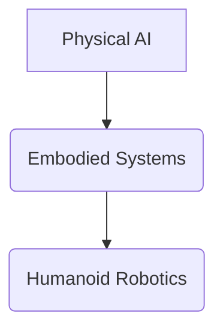

# Diagram: Physical AI Conceptual Flow

## Description

This diagram illustrates the conceptual flow from the broad definition of Physical AI to the more specific domain of Humanoid Robotics as an example of embodied systems.

## Components

1.  **Physical AI**: Artificial intelligence systems that are embodied and interact directly with the physical world.
2.  **Embodied Systems**: Systems that possess a physical body and interact with their environment through sensors and actuators.
3.  **Humanoid Robotics**: Robots designed to mimic the human form, representing a specialized and complex form of embodied AI operating in human-centric environments.

## Flow

The diagram starts with the general concept of Physical AI, which encompasses all embodied systems that interact with the physical world. A subset of these embodied systems are Humanoid Robotics, which specifically focuses on robots with human-like forms, enabling them to operate effectively in environments designed for humans.

## Visual Representation (Conceptual)

