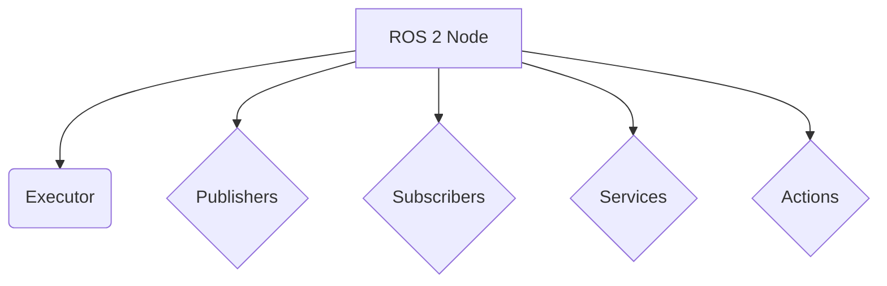

# Chapter 1: ROS 2 Nodes

In ROS 2, a **node** is the fundamental building block of a robotic system. You can think of a node as a small, single-purpose program that performs a specific task. For example, you might have one node for controlling a motor, another for reading a sensor, and a third for planning a path.

By breaking down a complex system into a collection of smaller nodes, you can create a modular and scalable system that is easier to debug and maintain.

## Creating a ROS 2 Node in Python

Let's create a simple "hello world" ROS 2 node using Python and `rclpy`.

First, create a new Python file named `hello_node.py` in your ROS 2 workspace.

```python
import rclpy
from rclpy.node import Node

class HelloNode(Node):
    def __init__(self):
        super().__init__('hello_node')
        self.get_logger().info('Hello, ROS 2!')

def main(args=None):
    rclpy.init(args=args)
    node = HelloNode()
    rclpy.spin(node)
    rclpy.shutdown()

if __name__ == '__main__':
    main()
```

In this example, we create a class `HelloNode` that inherits from `rclpy.node.Node`. In the constructor, we call the parent constructor with the node name `hello_node` and then log a message to the console.

The `main` function initializes `rclpy`, creates an instance of our node, and then enters a loop (`rclpy.spin()`) to keep the node running.

## Running the Node

To run the node, you first need to build your ROS 2 workspace and then source the setup file. After that, you can run the node using `ros2 run`:

```bash
ros2 run <your_package_name> hello_node
```

You should see the "Hello, ROS 2!" message printed to the console.

You can also use `ros2 node list` to see the running nodes:

```bash
ros2 node list
```

This should show `/hello_node` in the list of running nodes.

## Node Structure

Here is a simple diagram illustrating the basic structure of a ROS 2 node:

