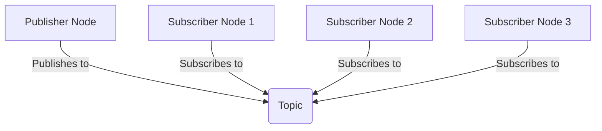
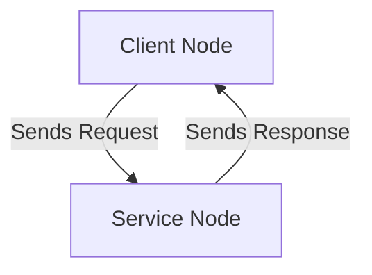

# Chapter 2: ROS 2 Topics and Services

In the previous chapter, we learned about ROS 2 nodes. Now, let's explore how these nodes communicate with each other. The two primary communication mechanisms in ROS 2 are **topics** and **services**.

## Topics

**Topics** are used for continuous data streams. A node can **publish** messages to a topic, and any number of other nodes can **subscribe** to that topic to receive the messages. This is a one-to-many communication model.

### Publisher/Subscriber Example

Let's create a simple publisher and subscriber.

**Publisher (`publisher_node.py`):**
```python
import rclpy
from rclpy.node import Node
from std_msgs.msg import String

class PublisherNode(Node):
    def __init__(self):
        super().__init__('publisher_node')
        self.publisher_ = self.create_publisher(String, 'chatter', 10)
        self.timer = self.create_timer(0.5, self.timer_callback)
        self.i = 0

    def timer_callback(self):
        msg = String()
        msg.data = f'Hello, ROS 2! {self.i}'
        self.publisher_.publish(msg)
        self.get_logger().info(f'Publishing: "{msg.data}"')
        self.i += 1

def main(args=None):
    rclpy.init(args=args)
    node = PublisherNode()
    rclpy.spin(node)
    rclpy.shutdown()

if __name__ == '__main__':
    main()
```

**Subscriber (`subscriber_node.py`):**
```python
import rclpy
from rclpy.node import Node
from std_msgs.msg import String

class SubscriberNode(Node):
    def __init__(self):
        super().__init__('subscriber_node')
        self.subscription = self.create_subscription(
            String,
            'chatter',
            self.listener_callback,
            10)
        self.subscription  # prevent unused variable warning

    def listener_callback(self, msg):
        self.get_logger().info(f'I heard: "{msg.data}"')

def main(args=None):
    rclpy.init(args=args)
    node = SubscriberNode()
    rclpy.spin(node)
    rclpy.shutdown()

if __name__ == '__main__':
    main()
```

### Publisher/Subscriber Model



## Services

**Services** are used for request/response communication. A node can offer a **service**, and another node can act as a **client** to send a request and wait for a response. This is a one-to-one communication model.

### Service/Client Example

Let's create a simple service and client.

**Service (`service_node.py`):**
```python
from example_interfaces.srv import AddTwoInts
import rclpy
from rclpy.node import Node

class ServiceNode(Node):
    def __init__(self):
        super().__init__('service_node')
        self.srv = self.create_service(AddTwoInts, 'add_two_ints', self.add_two_ints_callback)

    def add_two_ints_callback(self, request, response):
        response.sum = request.a + request.b
        self.get_logger().info(f'Incoming request\na: {request.a} b: {request.b}')
        self.get_logger().info(f'Sending back response: {response.sum}')
        return response

def main(args=None):
    rclpy.init(args=args)
    node = ServiceNode()
    rclpy.spin(node)
    rclpy.shutdown()

if __name__ == '__main__':
    main()
```

**Client (`client_node.py`):**
```python
import sys
from example_interfaces.srv import AddTwoInts
import rclpy
from rclpy.node import Node

class ClientNode(Node):
    def __init__(self):
        super().__init__('client_node')
        self.cli = self.create_client(AddTwoInts, 'add_two_ints')
        while not self.cli.wait_for_service(timeout_sec=1.0):
            self.get_logger().info('service not available, waiting again...')
        self.req = AddTwoInts.Request()

    def send_request(self):
        self.req.a = int(sys.argv[1])
        self.req.b = int(sys.argv[2])
        self.future = self.cli.call_async(self.req)

def main(args=None):
    rclpy.init(args=args)
    node = ClientNode()
    node.send_request()

    while rclpy.ok():
        rclpy.spin_once(node)
        if node.future.done():
            try:
                response = node.future.result()
            except Exception as e:
                node.get_logger().info(
                    'Service call failed %r' % (e,))
            else:
                node.get_logger().info(
                    'Result of add_two_ints: for %d + %d = %d' %
                    (node.req.a, node.req.b, response.sum))
            break

    rclpy.shutdown()

if __name__ == '__main__':
    main()
```

### Service/Client Model

